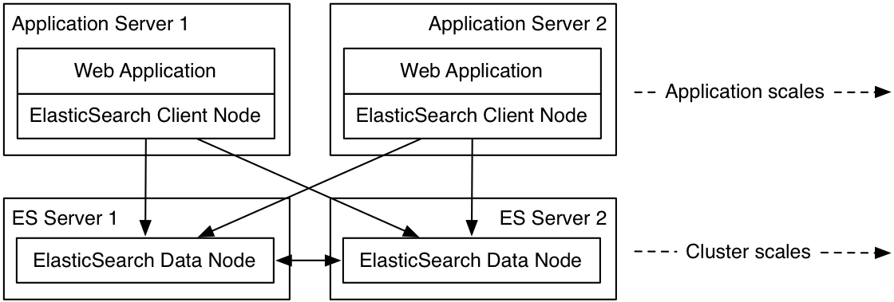

# Elastic Search

* [Eco-System](#ecosys)
    * [Core](#core)
    	* [Elastic Search](#es)
    * [Data Collection](#dc)
    	* [Logstash](#logs)
    	* [Beats](#beats)
    	* [Elasticsearch for Apache Hadoop](#)
    * [Visualization/Monitor](#vis)
        * [Kibana](#kib)
        * [Watcher](#wat)
    * [Others](#other)
        * [Marvel](#mar)
        * [Shield](#shld)
        * [Elastic Cloud](#escloud)
* [Architecture](#arch)
    * [Distributed Computing Platform](#dcp)
        * [Cluster](#cluster)
        * [Index](#index)
        * [Scale](#scale)
        * [What's inside?](#wsi)
* [ES Cluster](#esc)
    * [Deploy](#deploy)
    * [Performance](#prf)
    * [APIs](#api)
        * [Cluster APIs](#api)
            * [Shards Status](#capihckshard)
            * [Cluster Health](#capichckhealth)
            * [Reroute Shard](#capireroute)
        * [Indices API](#idcapi)
            * [Create Index](#idcapicreate)
            * [Delete Index](#idcapidelete)
        * [Document API](#dapi)
            * [Index Document](#dapidco)
            * [Get Document](#dapiget)
            * [Bulk API](#dapibulk)
        * [Search API](#sapi)
            * [Simple One](#sapisimple)
            * [Complicated One](#sapicomplicate)
            * [Keyword Search](#keywordsrch)
            * [Aggregate](#sapiagg)
            * [Filter/Sort](#sapifs)
* [Advanced](#adv)
    * [Auto-Complete](#autosug)
    * [Nested](#nested)
    * [Alias](#alias)
* [Java Library](#java)
    * [Bulkload](#javabulk)
    * [Alias](#alias)
    * [Scroll](#javascroll)
* [Reference](#ref)

## <a name="ecosys"></a>Eco-System

### <a name="core"></a>Core

#### <a name="es"></a>- Elastic Search

Elasticsearch is a distributed, open source search and analytics engine, designed for horizontal scalability, reliability, and easy management. It combines the speed of search with the power of analytics via a sophisticated, developer-friendly query language covering structured, unstructured, and time-series data.

### <a name="dc"></a>Data Collection

#### <a name="logs"></a>- Logstash

Logstash is a flexible, open source data collection, enrichment, and transportation pipeline. With connectors to common infrastructure for easy integration, Logstash is designed to efficiently process a growing list of log, event, and unstructured data sources for distribution into a variety of outputs, including Elasticsearch.

#### <a name="beats"></a>- Beats

Beats are the future of open source data shippers for Elasticsearch. From network packets to log files, infrastructure data, and beyond, Beats is the platform for building a variety of lightweight shippers to help you leverage any type of data you like.

#### <a name="hadoop"></a>- Elasticsearch for Apache Hadoop

Elasticsearch for Apache Hadoop — also known as ES-Hadoop — is a two-way connector that lets you read and write data to Elasticsearch and query it in real time. ES-Hadoop is an elegant solution that helps you leverage the power of both Hadoop and Elasticsearch.

### <a name="vis"></a>Visualization/Monitor

#### <a name="kib"></a>- Kibana

Kibana is an open source data visualization platform that allows you to interact with your data through stunning, powerful graphics. From histograms to geomaps, Kibana brings your data to life with visuals that can be combined into custom dashboards that help you share insights from your data far and wide.

#### <a name="wat"></a>- Watcher

Watcher is the alerting and notification product for Elasticsearch. If you can query it, you can alert on it. From proactively monitoring Elasticsearch to alerting you to anomalies in your logs, Watcher lets you take action based on changes in your data.

### <a name="other"></a>Others

#### <a name="mar"></a>- Marvel

Marvel is a comprehensive tool that provides you with complete transparency into the status of your Elasticsearch deployment. Monitor activity across your Elasticsearch cluster, diagnose issues quickly, and discover ways to fine-tune and optimize performance to get the most out of it.

#### <a name="shld"></a>- Shield

Shield brings enterprise-grade security to Elasticsearch, protecting the entire Elastic Stack with encrypted communications, authentication, role-based access control and auditing. Designed to address the growing security needs of businesses today, Shield provides peace of mind for your Elasticsearch data.

#### <a name="escloud"></a>- Elastic Cloud

Deploy your own Elasticsearch cluster in seconds. A fully hosted and managed solution, Elastic Cloud makes powering search, logging, or analytics a snap. It's a fast, scalable, and reliable solution that is developer-friendly and integrates with our commercial plugins.


## <a name="arch"></a>Architecture

### <a name="dcp"></a>Distributed Computing Platform



#### <a name="cluster"></a>Cluster (physical)

* Master Node
	* Candidates
	* Manage the cluster
	* Auto elect (*Split Brain*)
* Data Node
	* Worker (index, query)
	* Lucene index
* Client Node (optional)
	* REST interface
	* Route queries
	* Aggregate results from each shard

#### <a name="index"></a>Index (Logical)

* Index
* Shard (single lucene instance)
	* Primary
	* Replica (runtime config)
	* **number\_of\_shards** = index\_size / max\_shard\_size
    * `shard = hash(routing) % number_of_primary_shards`


#### <a name="scale"></a>Scale?

* auto discover (multicast or unicast)
* auto reassign
* auto support multi-core CPU
* and **DO NOT TRUST AUTO**
* Runtime change replica number
* Shard number is fixed in whole index lifecycle

#### <a name="wsi"></a>What's inside?

1. [Distributed Document Store](https://www.elastic.co/guide/en/elasticsearch/guide/master/distributed-docs.html)
2. [Distributed Search Execution](https://www.elastic.co/guide/en/elasticsearch/guide/current/distributed-search.html)
3. [Inside a Shard](https://www.elastic.co/guide/en/elasticsearch/guide/current/inside-a-shard.html)

## <a name="esc"></a>ES Cluster

### <a name="deploy"></a>Deploy

25 Servers

| Info       | Value  |
| ----       | ------ |
| Memory     | 30G    |
| Processor  | 4      |
| Disk       | 200G   |
| JDK        | 1.8    |
| ES Version | 1.7.0  |

```yml
# ES cluster setting
cluster.name: YOUR_ES_NAME
discovery.zen.ping.multicast.enabled: false
discovery.zen.ping.unicast.hosts : ["10.xxx.xxx.xxx","10.xxx.xxx.xxx","10.xxx.xxx.xxx"]

# ES node setting
node.name: YOUR_HOST_NAME
# master node
node.data: false
node.master: true
# data node
# node.data: true
# node.master: false
# client node
# node.data: false
# node.master: false


# Index setting
index.number_of_shards: 5
index.refresh_interval: -1

# CORS setting
http.cors.allow-credentials: true
http.cors.allow-origin: /.*/
http.cors.enabled: true

# ES data folder setting
path.data: ["/mnt/data"]
path.logs: /opt/ep/logs
```

### <a name="prf"></a>Performance

* 4 indices (8 shards each)
    * 120 Million Records
    *  15 Million Records
    *   7 Million Records
    *  25 Million Records
* index throughput (>16K per second)
    * 12K per second
    *  8K per second
    *  6K per second
    *  9K per second
* query 
    * regular search top 500 (2.2s)
    * four aggregations on all records (4s)
    * nine aggregation group by buckets on all records (12.6s)

### <a name="api"></a>APIs


#### <a name="clusterapi"></a>- Cluster API

[Official document](https://www.elastic.co/guide/en/elasticsearch/reference/current/cluster.html)

* <a name="capihckshard"></a>Shards Status 

```
$ curl 'http://localhost:9200/_cat/shards'
.marvel-2016.03.08 0 r STARTED      908421 934.7mb 10.65.251.17  bpe-es-5166.slc01.dev.c3.com 
.marvel-2016.03.08 0 p STARTED      908421 934.7mb 10.65.246.220 bpe-es-9198.slc01.dev.c3.com 
.marvel-2016.03.09 0 p STARTED      868424 889.7mb 10.65.217.119 bpe-es-8955.slc01.dev.c3.com 
.marvel-2016.03.09 0 r STARTED      868424 889.7mb 10.65.246.22  bpe-es-3192.slc01.dev.c3.com 
.marvel-2015.12.29 0 p STARTED      374853 553.1mb 10.65.254.163 bpe-es-4899.slc01.dev.c3.com 
.marvel-2015.12.29 0 r STARTED      374853 553.1mb 10.65.246.220 bpe-es-9198.slc01.dev.c3.com 
.marvel-2015.12.28 0 p STARTED      362034 539.7mb 10.65.254.163 bpe-es-4899.slc01.dev.c3.com 
.marvel-2015.12.28 0 r STARTED      362034 539.7mb 10.65.221.214 bpe-es-9950.slc01.dev.c3.com 
.marvel-2015.12.27 0 r STARTED      356848   539mb 10.65.254.163 bpe-es-4899.slc01.dev.c3.com 
.marvel-2015.12.27 0 p STARTED      356848   539mb 10.65.203.164 bpe-es-3371.slc01.dev.c3.com 
.marvel-2016.03.01 0 r STARTED      855520 888.2mb 10.65.251.17  bpe-es-5166.slc01.dev.c3.com 
.marvel-2016.03.01 0 p STARTED      855520 888.2mb 10.65.221.214 bpe-es-9950.slc01.dev.c3.com 
.marvel-2015.12.26 0 p STARTED      341590 522.6mb 10.65.254.163 bpe-es-4899.slc01.dev.c3.com 
.marvel-2015.12.26 0 r STARTED      341590 522.6mb 10.65.221.214 bpe-es-9950.slc01.dev.c3.com 
.marvel-2016.03.02 0 p STARTED      826767 858.3mb 10.65.203.164 bpe-es-3371.slc01.dev.c3.com 
.marvel-2016.03.02 0 r STARTED      826767 858.3mb 10.65.221.106 bpe-es-4948.slc01.dev.c3.com 
.marvel-2016.03.03 0 r STARTED      876258 903.2mb 10.65.251.17  bpe-es-5166.slc01.dev.c3.com 
.marvel-2016.03.03 0 p STARTED      876258 903.2mb 10.65.217.119 bpe-es-8955.slc01.dev.c3.com 
```

* <a name="capichckhealth""></a>Cluster Health 

```
$ curl 'http://localhost:9200/_cluster/health?level=indices&pretty'
{
  "cluster_name" : "bpe_elasticsearch",
  "status" : "red",
  "timed_out" : false,
  "number_of_nodes" : 8,
  "number_of_data_nodes" : 8,
  "active_primary_shards" : 128,
  "active_shards" : 256,
  "relocating_shards" : 0,
  "initializing_shards" : 0,
  "unassigned_shards" : 22,
  "number_of_pending_tasks" : 0,
  "indices" : {
    ".marvel-2016.03.08" : {
      "status" : "green",
      "number_of_shards" : 1,
      "number_of_replicas" : 1,
      "active_primary_shards" : 1,
      "active_shards" : 2,
      "relocating_shards" : 0,
      "initializing_shards" : 0,
      "unassigned_shards" : 0
    },
    ...
  }
}
```

* <a name="capireroute"></a>Reroute Shard

```
$ curl -X POST -H "Content-Type: application/json" -d '{
        "commands" : [ {
              "allocate" : {
                  "index" : ".marvel-kibana", 
                  "shard" : 3, 
                  "node" : "10.65.203.164", 
                  "allow_primary" : true
              }
            }
        ]
    }' "http://localhost:9200/_cluster/reroute"
```

#### <a name="idcapi"></a>- Indices API

[Official document](https://www.elastic.co/guide/en/elasticsearch/reference/1.7/indices.html)

* <a name="idcapicreate"></a>Create Index

```
$ curl -X POST -H "Content-Type: application/json" -d '{
    "mappings" : {
        "item" : {
            "_source" : { "enabled" : true },
            "properties" : {
                	"ITEM_ID" : {
						"type" : "string",
					    "index": "not_analyzed"
					},
					"URL" : {
						"type" : "string",
					    "index": "no"
					},
					"AUCT_TITL" : {
						"type" : "string",
					    "index": "analyzed"
					},
					"VI" : {
						"type" : "float",
					    "index": "not_analyzed"
					}
            }
        }
    }
}' "http://localhost:9200/market/"
```

* <a name="idcapidelete"></a>Delete Index

```
$ curl -X DELETE -H "Content-Type: application/json" "http://localhost:9200/market/"
```

#### <a name="dapi"></a>- Documents API

[Official document](https://www.elastic.co/guide/en/elasticsearch/reference/1.7/docs.html)

* <a name="dapidco"></a>Index Docuemnt

```
$ curl -XPUT 'http://localhost:9200/twitter/tweet/1' -d '{
    "user" : "kimchy",
    "post_date" : "2009-11-15T14:12:12",
    "message" : "trying out Elasticsearch"
}'
```

* <a name="dapiget"></a>Get Document

```
$ curl -XGET 'http://localhost:9200/twitter/tweet/1'
```

* <a name="dapibulk"></a>[Bulk API](https://www.elastic.co/guide/en/elasticsearch/reference/1.7/docs-bulk.html#docs-bulk)

#### <a name="sapi"></a>- Search API

[Official document](https://www.elastic.co/guide/en/elasticsearch/reference/1.7/search.html)

* <a name="sapisimple"></a>Simple

```
$ curl -XGET 'http://localhost:9200/twitter/_search?q=user:kimchy'
$ curl -XGET 'http://localhost:9200/twitter/tweet,user/_search?q=user:kimchy'
```
* <a name="sapicomplicate"></a>Complicated

```
$ curl -XPOST 'http://localhost:9200/twitter/tweet/_search' -d '{
    "query" : {
        "term" : { "user" : "kimchy" }
    }
}'
```

* <a name="keywordsrch"></a> Keyword Search

```
{
  "query": {
    "filtered": {
      "query": {
        "bool": {
          "must": [
            {
              "match": {
                "AUCT_TITL": {
                  "query": "iphone",
                  "operator": "and"
                }
              }
            }
          ]
        }
      }
    }
  },
  "size": 50
}
```

* <a name="sapiagg"></a>Aggregate

```
$ curl -XPOST 'http://localhost:9200/market/item/_search' -d '{
  "query": {
    "filtered": {
      "query": {
        "match_all": {}
      }
    }
  },
  "size": 0,
  "aggregations": {
    "GMV": {
      "sum": {
        "field": "GMV"
      }
    },
    "VI": {
      "sum": {
        "field": "VI"
      }
    },
    "SI": {
      "sum": {
        "field": "SI"
      }
    }
  }
}'

{
  "took" : 3981,
  "timed_out" : false,
  "_shards" : {
    "total" : 8,
    "successful" : 8,
    "failed" : 0
  },
  "hits" : {
    "total" : 118980321,
    "max_score" : 0.0,
    "hits" : [ ]
  },
  "aggregations" : {
    "GMV" : {
      "value" : XXXXX
    },
    "VI" : {
      "value" : XXXXX
    },
    "SI" : {
      "value" : XXXXX
    }
  }
}
```

* <a name="sapifs"></a>Filter/Sort

```
$ curl -XPOST 'http://localhost:9200/market/item/_search' -d'
{
  "query": {
    "filtered": {
      "query": {
        "match_all": {
           
        }
      },
      "filter": {
        "term": {
          "Free_Shipping": "Free Shipping"
        }
      }
    }
  },
  "sort": [
    {
      "ITEM_ID": {
        "order": "asc"
      }
    }
  ],
  "size": 0,
  "aggs": {
    "term_values": {
      "terms": {
        "field": "META_CATEG_NAME",
        "size": 0
      }
    }
  }
}
'
```

## <a name="adv"></a>Advanced

### <a name="autosug"></a>Auto-Complete

[Official document](https://www.elastic.co/guide/en/elasticsearch/reference/1.7/search-suggesters-completion.html)

Index Schema

```
"MRCHNT_NAME" : {
  "type" : "string",
  "index": "not_analyzed",
  "fields": {
    "sug": {
      "type": "completion",
      "analyzer": "simple"
    }
  }
},
"Brand" : {
  "type" : "string",
  "index": "not_analyzed",
  "fields": {
    "sug": {
      "type": "completion",
      "analyzer": "simple"
    }
  }
}
```

Request Suggestion

```
$ curl -XPOST 'http://localhost:9200/us_latest/_suggest' -d '
{
    "seller_name_sug" : {
        "text" : "tree",
        "completion" : {
            "field" : "MRCHNT_NAME.sug",
            "size" : 10
        }
    },
    "brand_sug" : {
        "text" : "apple",
        "completion" : {
            "field" : "Brand.sug",
            "size" : 10
        }
    }
}
'
```

### <a name="nested"></a>Nested 

[Official document](https://www.elastic.co/guide/en/elasticsearch/reference/1.7/mapping-nested-type.html)


Index Schema

```
"COMP_PRICE" : {
  "type" : "nested",
  "properties": {
    "comp" : {"type": "string", "index": "not_analyzed" },
    "price"  : {"type": "float" },
    "discount"  : {"type": "float" }
  }
},
```

Search by nested value

```
{
  "query": {
    "filtered": {
      "query": {
        "bool": {
          "must": [
            {
              "nested": {
                "path" : "COMP_DEAL",
                "query" : {
                    "bool": {
                        "should": [
                            {"match" : {"COMP_PRICE.type" : "MD"}}
                        ]
                    }
                      
                }
              }
            }
          ]
        }
      },
      "filter": {
        "and": {
          "filters": [
            {
              "term": {
                "META_CATEG_NAME": "Books"
              }
            },
            {
              "term": {
                "Item_Condition": "New"
              }
            }
          ]
        }
      }
    }
  },
  "size": 50,
  "from": 0
}
```

### <a name="alias"></a>Alias

[Official document](https://www.elastic.co/guide/en/elasticsearch/reference/1.7/indices-aliases.html)

```
curl -XPOST 'http://localhost:9200/_aliases' -d '
{
    "actions" : [
        { "add" : { "index" : "test2", "alias" : "alias1" } },
        { "remove" : { "index" : "test1", "alias" : "alias1" } }
    ]
}'
```

## <a name="java"></a>Java Library

[Official document](https://www.elastic.co/guide/en/elasticsearch/client/java-api/1.7/index.html)

### <a name="javabulk"></a>Bulkload

```scala
val host: String = "YOUR_ES_MASTER"
val port: Int = 9300
val clusterName: String = "YOUR_ES_CLUSTER_NAME"

val settings = ImmutableSettings.settingsBuilder().put("cluster.name", clusterName).build()

// create ES client
val client: TransportClient = new TransportClient(settings)
            .addTransportAddress(new InetSocketTransportAddress(host, port))
            
// init bulk processor
val bulkProcessor: BulkProcessor = BulkProcessor.builder(
      client,
      new BulkProcessor.Listener() {
        override def beforeBulk(executionId: Long, request: BulkRequest): Unit = {}

        override def afterBulk(executionId: Long, request: BulkRequest, response: BulkResponse): Unit = {
          // may have failure
          if(response.hasFailures) {
            var ids = Set[String]()
            response.getItems.filter(_.isFailed).foreach(bulkItemResponse => {
              ids += bulkItemResponse.getId
            })

            request.requests().foreach(r => {
              if(r.isInstanceOf[IndexRequest]) {
                val idxr = r.asInstanceOf[IndexRequest]
                if (ids.contains(idxr.id())) {
                  // handle Index Error
                  ???
                }
              }
            })
          }
        }

        override def afterBulk(executionId: Long, request: BulkRequest, failure: Throwable): Unit = {
          // for sure have failure
          request.requests().foreach(r => {
            if(r.isInstanceOf[IndexRequest]) {
              val idxr = r.asInstanceOf[IndexRequest]
              // handle Index Error
              ???
            }
          })
        }
      })
      .setBulkActions(1000)
      .setBulkSize(new ByteSizeValue(1, ByteSizeUnit.GB))
      .setFlushInterval(TimeValue.timeValueSeconds(5))
      .setConcurrentRequests(5)
      .build();
      
// index document      
bulkProcessor.add(new IndexRequest(index, "item", json.get._1).source(doc.toJson))
```

### <a name="javaalias"></a>Alias

```scala
// create alias
client.admin()
      .indices()
      .prepareAliases()
      .addAlias(indexName, aliasName)
      .execute()
      .actionGet()
      
// point alias to new index
client.admin()
      .indices()
      .prepareAliases()
      .removeAlias(oldIndexName, aliasName)
      .addAlias(newIndexName, aliasName)
      .execute()
      .actionGet()
```

### <a name="javascroll"></a>Scroll

```scala
// set scroll live time in request
search.setScroll(new TimeValue(SCROLL_LIVE_TIME))

// get 1st page
var scrollResp: SearchResponse = search.execute().actionGet()

// iterate each hit
scrollResp.getHits().getHits().foreach(hit => ???)

// get next page
scrollResp = client.prepareSearchScroll(scrollResp.getScrollId())
                   .setScroll(new TimeValue(SCROLL_LIVE_TIME))
                   .execute()
                   .actionGet()

// check response size
scrollResp.getHits().getHits().length
            
```


## <a name="ref"></a>Reference

1. [ES Performance](https://blog.liip.ch/archive/2013/07/19/on-elasticsearch-performance.html)
2. [Inside a Shard](https://www.elastic.co/guide/en/elasticsearch/guide/current/inside-a-shard.html)
3. [Distributed Search Execution](https://www.elastic.co/guide/en/elasticsearch/guide/current/distributed-search.html)
4. [Distributed Document Store](https://www.elastic.co/guide/en/elasticsearch/guide/master/distributed-docs.html)
